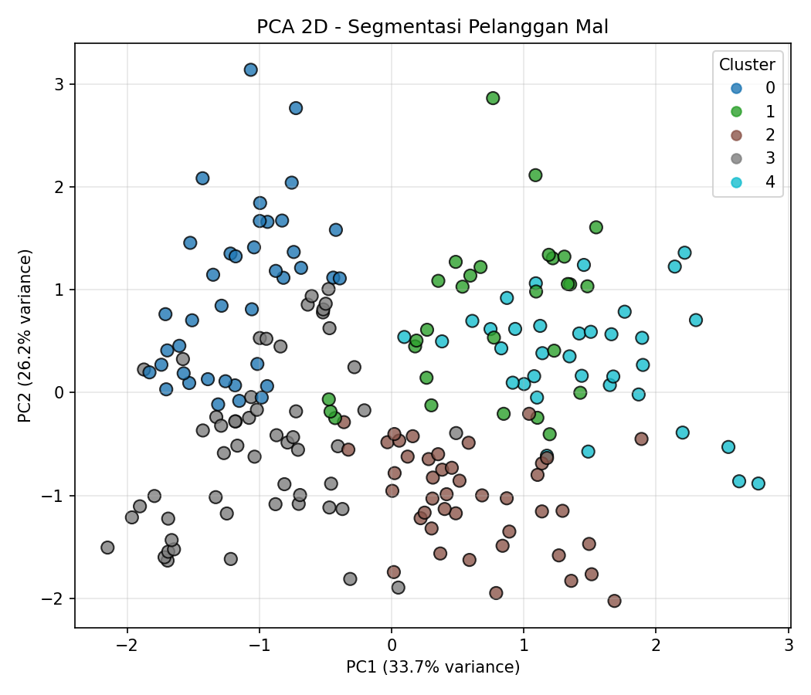
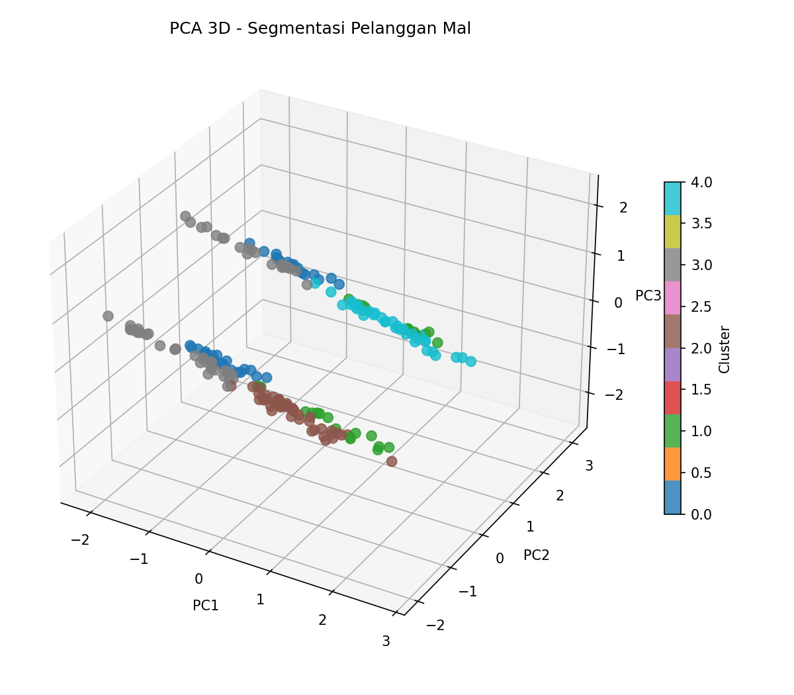
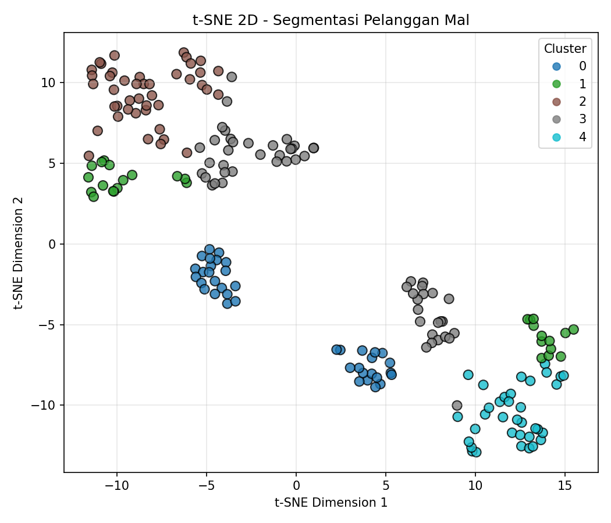

# Dimensionality Reduction: PCA & t-SNE — Mall Customer Segmentation (Kaggle)

Tugas Praktik Dimensionality Reduction (Pertemuan ke-25)

## 1. Deskripsi Kasus

**Kasus penggunaan:** Eksplorasi cluster / customer segmentation.

**Masalah yang dihadapi:**
Sebuah pusat perbelanjaan (mal) memiliki data 200 pelanggan yang mencakup Gender, Age (usia), Annual Income (pendapatan tahunan), dan Spending Score (skor belanja 1-100). Pihak mal ingin memahami apakah ada **kelompok pelanggan** dengan karakteristik serupa (misalnya "pendapatan tinggi tapi belanja rendah" vs "pendapatan rendah tapi belanja tinggi") supaya strategi pemasaran bisa lebih tepat sasaran per segmen. Karena datanya terdiri dari beberapa fitur numerik sekaligus, sulit melihat pola pengelompokan hanya dari tabel angka mentah atau satu scatter plot 2 fitur saja.

**Mengapa dimensionality reduction dibutuhkan:**
Dimensionality reduction memproyeksikan seluruh fitur pelanggan ke ruang 2D/3D sehingga pola pengelompokan (cluster) pelanggan bisa divisualisasikan dan diinterpretasikan sekaligus, alih-alih menganalisis kombinasi fitur satu per satu.

## 2. Dataset

- **Sumber:** Kaggle — [Mall Customer Segmentation Data](https://www.kaggle.com/datasets/vjchoudhary7/customer-segmentation-tutorial-in-python) (file `Mall_Customers.csv`)
- **Jumlah sampel:** 200 pelanggan
- **Kolom:** `CustomerID` (dibuang, hanya identifier), `Gender` (di-encode 0/1), `Age`, `Annual Income (k$)`, `Spending Score (1-100)`
- **Catatan:** dataset ini tidak punya label kelas — cluster yang muncul murni hasil pengelompokan tanpa supervisi (unsupervised). Sebagai referensi visual, digunakan **K-Means (k=5)** untuk memberi label warna pada hasil PCA/t-SNE.

## 3. Ringkasan Metode

### PCA (Principal Component Analysis)
Metode linear yang mencari arah (komponen utama) dengan variansi terbesar, lalu memproyeksikan data ke arah tersebut. Data distandarisasi (`StandardScaler`) terlebih dulu karena skala Age, Income, dan Spending Score sangat berbeda.

- PC1 menjelaskan **33.7%** variansi
- PC2 menjelaskan **26.2%** variansi
- PC1+PC2 (2D) mempertahankan total **59.9%** variansi
- PC1+PC2+PC3 (3D) mempertahankan total **83.2%** variansi

### t-SNE (t-Distributed Stochastic Neighbor Embedding)
Metode non-linear yang mempertahankan kemiripan **lokal** antar pelanggan. Parameter: `n_components=2`, `perplexity=30`, `init="pca"`.

## 4. Hasil & Visualisasi

| PCA 2D | PCA 3D | t-SNE 2D |
|---|---|---|
|  |  |  |

**Makna hasil PCA:** PC1 dan PC2 bersama-sama menjelaskan hampir 60% variansi dari 4 fitur pelanggan. Pada scatter 2D terlihat beberapa kelompok pelanggan terpisah, tapi beberapa cluster masih berdekatan/tumpang tindih di area tengah karena PCA memproyeksikan berdasarkan variansi gabungan semua fitur sekaligus.

**Pola/cluster pada t-SNE:** t-SNE menghasilkan pemisahan segmen pelanggan yang jauh lebih rapat dan tegas. Kelima segmen (misalnya "income tinggi & spending tinggi", "income rendah & spending tinggi", dst.) terlihat sebagai kelompok titik yang benar-benar terpisah, karena t-SNE fokus menjaga kemiripan lokal antar pelanggan yang perilakunya benar-benar mirip.

## 5. Analisis: Perbedaan PCA vs t-SNE

| Aspek | PCA | t-SNE |
|---|---|---|
| Sifat metode | Linear | Non-linear |
| Yang dipertahankan | Variansi global | Struktur/kemiripan lokal |
| Interpretasi sumbu | Bermakna (explained variance) | Tidak bermakna langsung, hanya untuk visualisasi |
| Kecepatan komputasi | Sangat cepat | Lebih lambat (kompleksitas kuadratik) |
| Konsistensi hasil | Deterministik | Stokastik, sensitif terhadap parameter perplexity |
| Hasil cluster pada kasus ini | Beberapa cluster tumpang tindih di tengah | Cluster terpisah jauh lebih tegas |

**Metode mana yang lebih sesuai untuk kasus ini?**
Untuk kasus **customer segmentation**, **t-SNE lebih unggul secara visual** karena segmen pelanggan jauh lebih mudah diidentifikasi dan dijelaskan ke tim marketing untuk merancang strategi promosi per segmen. Namun **PCA tetap lebih sesuai** jika dibutuhkan reduksi fitur yang cepat & deterministik sebagai preprocessing sebelum model prediktif lain (misalnya prediksi churn), atau untuk mengetahui fitur mana yang paling berkontribusi terhadap variansi data secara kuantitatif.

**Kesimpulan:** untuk memahami & mempresentasikan segmen pelanggan secara visual, gunakan **t-SNE**. Untuk preprocessing sebelum modeling lanjutan, gunakan **PCA**.

## Struktur Repository

```
.
├── Dimensionality_Reduction_MallCustomers_PCA_tSNE.ipynb   # Notebook lengkap (kode + narasi + output)
├── Mall_Customers.csv                                       # Dataset asli dari Kaggle
├── images/
│   ├── pca_2d.png
│   ├── pca_3d.png
│   └── tsne_2d.png
└── README.md
```

## Referensi
- Dataset: Kaggle — Mall Customer Segmentation Data
- DataCamp — Understanding Dimensionality Reduction
- DataCamp — Introduction to t-SNE
- GeeksforGeeks — Introduction to Dimensionality Reduction
- IBM — What is Dimensionality Reduction?
